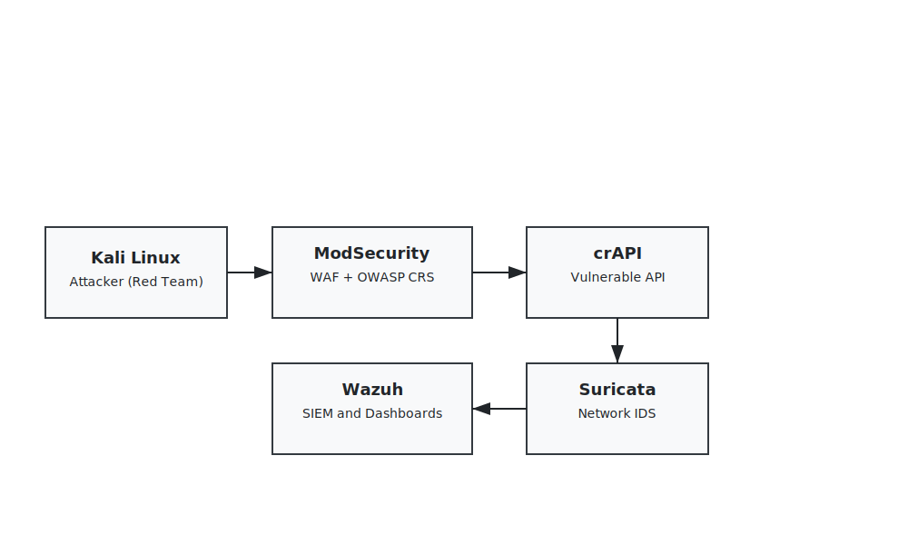

# 🛡️ Cyber Range – API Security (Red Team / Blue Team)

## 📌 Project Overview

This project implements a **Cyber Range for API Security**, designed to simulate realistic cyber-attacks and evaluate defensive mechanisms using a **defense-in-depth** strategy.

The environment combines **offensive security testing (Red Team)** and **defensive monitoring & response (Blue Team)**, focusing on vulnerabilities from the **OWASP API Security Top 10**.

---

## 🎯 Project Objectives

### 🔴 Red Team Objectives
- Identify and exploit vulnerabilities in a deliberately vulnerable API (**crAPI**)
- Perform attacks such as:
  - NoSQL Injection
  - BOLA / BFLA
  - SSRF
  - Mass Assignment
  - Brute-force authentication
- Validate exploit impact and bypass attempts

### 🔵 Blue Team Objectives
- Detect malicious activity using **Suricata (IDS)** and **Wazuh (SIEM)**
- Block attacks using **ModSecurity (WAF + OWASP CRS)**
- Correlate security events and generate alerts
- Visualize incidents via dashboards
- Automate response actions (IP blocking, alerting)

---

## 🧱 Architecture

### Security Flow (Defense-in-Depth)

Kali Linux (Attacker)
↓
ModSecurity (WAF + OWASP CRS)
↓
crAPI (Vulnerable API)
↓
Suricata (Network IDS)
↓
Wazuh (SIEM + Dashboards + Active Response)

### Components

| Component | Description |
|--------|------------|
| Kali Linux | Attacker machine (Red Team) |
| ModSecurity | Web Application Firewall (Reverse Proxy) |
| crAPI | Vulnerable REST API |
| Suricata | Network Intrusion Detection System |
| Wazuh | SIEM, correlation & response |
| AWS EC2 | Cloud infrastructure |
| Docker | Application deployment |

---

## ☁️ AWS Infrastructure

| Service | Instance Type | Resources |
|------|--------------|-----------|
| Wazuh Server | t3.large | 2 vCPU / 8 GB RAM / 100 GB Disk |
| Suricata | t3.medium | 2 vCPU / 4 GB RAM |
| crAPI | t3.medium | 2 vCPU / 4 GB RAM |
| ModSecurity | t3.medium | 2 vCPU / 4 GB RAM |

---

## 🚀 Deployment Summary

### 🔹 Wazuh (SIEM)
- Docker-based deployment
- Single-node architecture
- Integrated ELK stack
- Dashboards & alerts enabled

### 🔹 Suricata (IDS)
- Emerging Threats rules
- Network traffic inspection
- Integrated with Wazuh

### 🔹 crAPI
- Docker Compose deployment
- Intentionally vulnerable API
- Used for security testing

### 🔹 ModSecurity (WAF)
- Apache reverse proxy
- OWASP Core Rule Set (CRS)
- Full inspection of API traffic

---

## 🔍 Red Team Testing

### Tools Used
- Burp Suite
- OWASP ZAP
- Nmap
- Nikto

### Vulnerabilities Tested
- NoSQL Injection
- SSRF
- Broken Object Level Authorization (BOLA)
- Broken Function Level Authorization (BFLA)
- Mass Assignment
- Login & OTP Brute-Force
- Excessive Data Exposure
- Improper Assets Management

---

## 📊 Vulnerability Summary

| Severity | Count |
|--------|------|
| Critical | 1 |
| High | 5 |
| Moderate | 4 |
| Low | 0 |
| Informational | 0 |

---

## 📈 Detection & Response

- **Suricata** detects suspicious network traffic
- **ModSecurity** blocks malicious requests
- **Wazuh** correlates:
  - IDS alerts
  - WAF logs
  - Application logs
- **Active Response**:
  - Automatically blocks attacker IPs
  - Generates SIEM alerts

---

## 🧠 Key Learnings

- APIs are high-value attack surfaces
- WAF alone is insufficient
- IDS + SIEM correlation is critical
- Automation improves incident response
- Cyber Ranges are ideal for training and validation

---

## 🔮 Future Improvements

- SOAR playbooks integration
- MITRE ATT&CK mapping
- CI/CD security testing
- Terraform-based deployment
- Advanced attack scenarios

---

## 📎 References

- OWASP API Security Top 10  
- https://github.com/OWASP/crAPI  
- https://documentation.wazuh.com  
- https://suricata.io  
- https://owasp.org/www-project-modsecurity-core-rule-set  

---

## 👤 Author

**Anas Aouina**  
Master – Cyber Defense & Information Security  

---

## 📜 License

This project is intended for **educational and research purposes only**.
